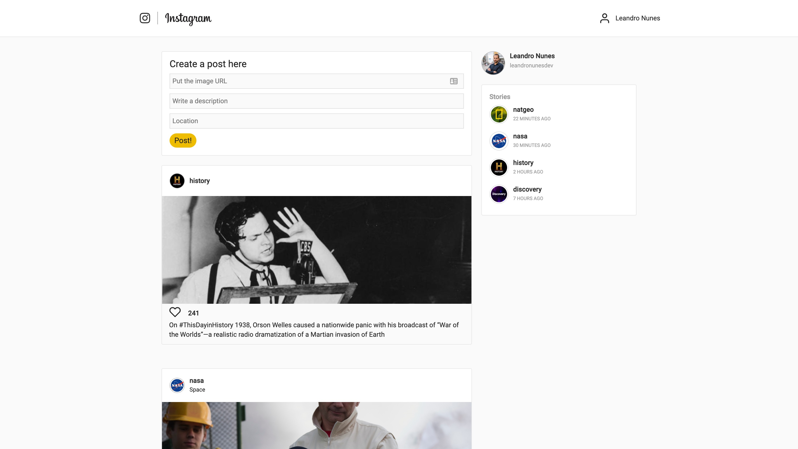

# Instagram Clone

## Instagram Clone project using Redux

<p align="center">
 <a href="#features">Features</a> •
 <a href="#demo">App image</a> •
 <a href="#requirements">Requirements</a> •
 <a href="#technologies">Technologies</a> • 
 <a href="#autor">Author</a>
</p>

<h4 align="center"> 
	Finished project ✅
</h4>

<h1 id="features">Features</h1>

- [x] Post creation
- [x] Posts list automatically updated
- [x] Counting of "likes"

<h1 id="demo">App image</h1>

<h1 align="center">
  
</h1>

<h1 id="requirements">Requirements</h1>

Before starting, you need to install in your machines the following tools:
[Git](https://git-scm.com), [Node.js](https://nodejs.org/en/).
Besides that, is good to have a good code editor as [VSCode](https://code.visualstudio.com/)

### 🎲 Running the application

```bash
# Clone este repositório
$ git clone <https://github.com/leandronunesdev/instagram_clone_22>

# Acces the project folder using terminal/cmd
$ cd instagram_clone_22

# Install the dependencies
$ npm install

# Run the Fake API on local server using the terminal/cmd
$ json-server --watch api.json --port 4000

# The Fake API server will start on port:4000 - access <http://localhost:4000>

# Execute the aplication on development mode
$ npm start

# The server will start on port:3000 - access <http://localhost:3000>
```

<h1 id="technologies">🛠 Technologies</h1>

The following tools were used on this project:

- [Node.js](https://nodejs.org/en/)
- [React](https://pt-br.reactjs.org/)
- [TypeScript](https://www.typescriptlang.org/)
- [Redux](https://redux.js.org/)

<h1 id="author">🛠 Author</h1>

<a href="https://github.com/leandronunesdev">
 
 <br />
 <sub><b>Leandro Nunes</b></sub></a> <a href="https://github.com/leandronunesdev" title="Leandro">🚀</a>

Made with ❤️ by Leandro Nunes

👋🏽 Reach out!

<a href="https://leandronunes.dev/">Website<a> |
<a href="https://www.linkedin.com/in/nunesprofissional/">Linkedin<a> |
<a href="mailto:https://www.linkedin.com/in/nunesprofissional/">E-mail<a> |
<a href="https://twitter.com/leandro_nunes">Twitter<a>
